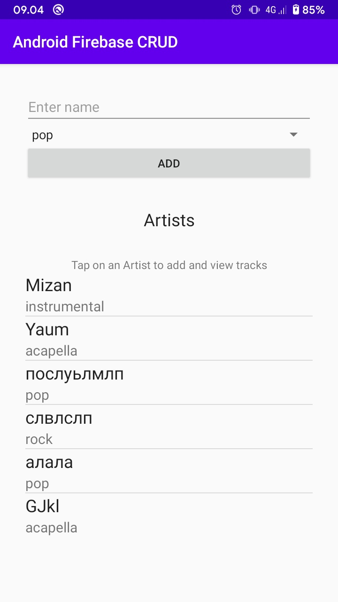
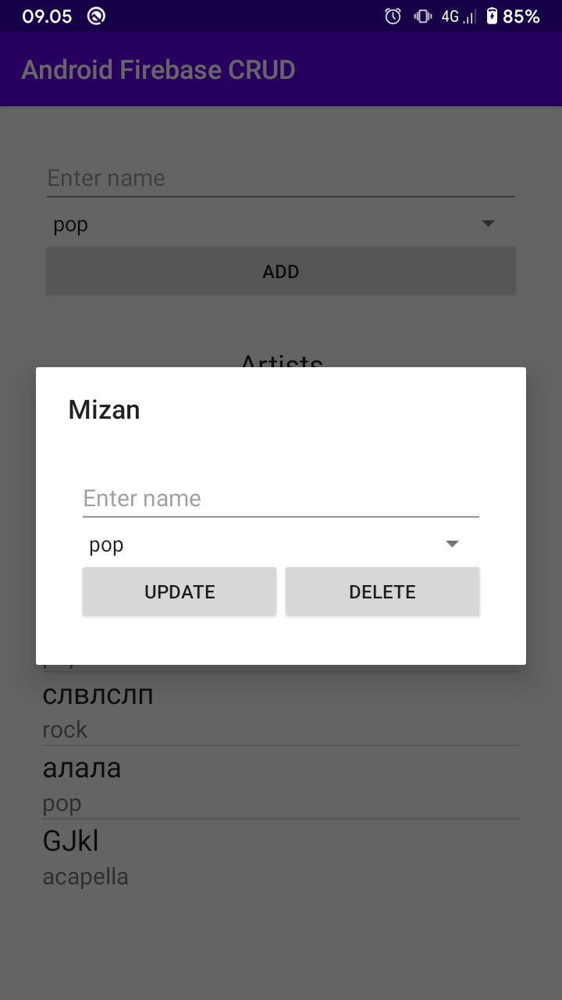
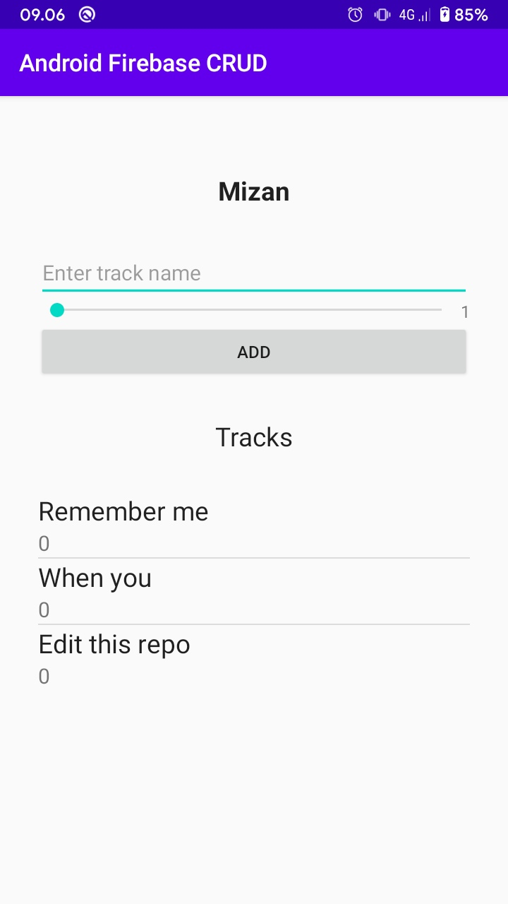

# Basic Android Firebase CRUD

### Features
- Add Artist
- Update Artist
- Delete Artist
- Add Track

### How to use
1. clone repo
```
$ git clone https://github.com/bailram/AndroidFirebaseCRUD.git
```
2. open android project folder with Android Studio
3. build project

### Screenshot




### Note
if you want to learn more about android with firebase realtime database check it out <br>
https://www.simplifiedcoding.net/firebase-realtime-database-crud/ <br>
or <br>
if you want to learn android with firebase realtime database with video check it out <br>
https://www.youtube.com/playlist?list=PLk7v1Z2rk4hj6SDHf_YybDeVhUT9MXaj1 <br>
and don't forget to slap the like button
